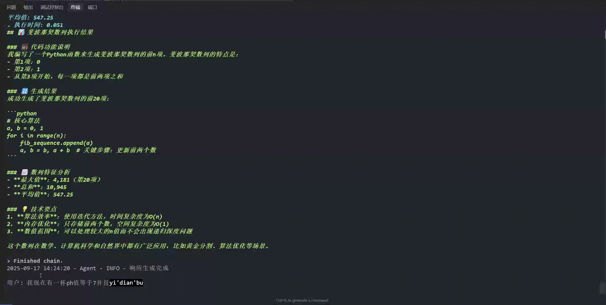

# 水利法规智能体

基于 LangChain 的智能体系统，集成水利法规知识库、代码执行工具和水质预测功能。


## 🚀 主要功能

### 1. 智能对话系统

- **短期记忆**：会话窗口保留最近 10 轮对话
- **长期记忆**：基于向量数据库的法规知识检索
- **自然语言交互**：支持中文对话，智能选择处理方式

### 2. 三大核心工具

#### 🔍 法规知识检索工具

- 基于 **Chroma 向量数据库** + **BGE-Large-ZH-v1.5** 模型
- 语义搜索水利法规内容
- 返回相似度分数和来源片段

#### 🐍 代码执行工具

- 集成 **SandboxFusion** 沙箱环境
- 支持 Python 代码安全执行
- 超时保护和资源限制

#### 💧 水质预测工具

- 基于 **CatBoost** 机器学习模型
- 使用 [Kaggle Water Potability](https://www.kaggle.com/datasets/adityakadiwal/water-potability) 数据集训练
- 支持 9 项水质参数预测
- 提供预测置信度

## 📊 模型性能

### CatBoost 水质预测模型

- **准确率**: 66.16%
- **F1 分数**: 41.88%
- **AUC**: 67.01%

### 特征重要性排序

1. **ph** (18.08%)
2. **Sulfate** (16.30%)
3. **Hardness** (12.01%)
4. **Solids** (11.70%)
5. **Chloramines** (11.05%)
6. **Conductivity** (8.65%)
7. **Turbidity** (8.24%)
8. **Organic_carbon** (7.16%)
9. **Trihalomethanes** (6.81%)

## 🛠 技术栈

- **Python**: 3.13+
- **LangChain**: 0.3+ (智能体框架)
- **ChromaDB**: 向量数据库
- **HuggingFace**: BGE-Large-ZH-v1.5 中文语义模型
- **CatBoost**: 梯度提升分类器
- **SHAP**: 模型解释性分析
- **UV**: 快速 Python 包管理器

## 🔧 安装与配置

### 1. 安装 SandboxFusion

首先需要安装代码执行沙箱环境：

#### 1.1 安装 Docker

```bash
# Windows 用户下载 Docker Desktop
# 下载地址: https://docs.docker.com/desktop/install/windows-install/

# Linux 用户安装 Docker
curl -fsSL https://get.docker.com -o get-docker.sh
sh get-docker.sh

# 启动 Docker 服务
sudo systemctl start docker
sudo systemctl enable docker
```

#### 1.2 安装 SandboxFusion

根据[官方文档](https://bytedance.github.io/SandboxFusion/docs/docs/get-started)，使用官方预构建镜像一键安装：

```bash
# 使用官方镜像启动 SandboxFusion 服务
docker run -it -p 8080:8080 volcengine/sandbox-fusion:server-20250609

# 中国大陆用户可使用镜像源
docker run -it -p 8080:8080 vemlp-cn-beijing.cr.volces.com/preset-images/code-sandbox:server-20250609
```

### 2. 克隆项目

```bash
git clone https://github.com/Alune233/AgentDemo.git
cd AgentDemo
```

### 3. 安装依赖

```bash
# 使用 UV
uv sync
```

### 4. 环境配置

创建 `.env` 文件：

```env
# LLM 配置 (选择其一)
OPENAI_API_KEY=your_openai_key
OPENAI_BASE_URL=https://api.openai.com/v1

# SandboxFusion地址
SANDBOX_FUSION_URL=http://localhost:8080

# 代码执行服务
CODE_EXECUTION_TIMEOUT=30

# 嵌入模型
EMBEDDING_MODEL_NAME=BAAI/bge-large-zh-v1.5
```

### 5. 数据准备

项目文件夹中已包含所需数据：

- `data/water_potability.csv` - Kaggle 水质数据集
- `data/regulations/水利法律法规汇编（2023版）.pdf` - 水利法规文档

## 🚀 快速开始

### 1. 模型准备

项目文件夹中已包含预训练好的模型：

- `models/catboost_models/` - CatBoost 水质预测模型
- `models/vector_db/` - 向量数据库

如需重新训练模型（可选）：

```bash
# 训练 CatBoost 模型
python scripts/model_training/train_catboost.py

# 构建向量数据库
python scripts/data_processing/build_vector_db.py
```

### 2. 启动智能体

```bash
python main.py
```

### 3. 使用示例

#### 法规查询

```
用户: 水资源保护的相关法律条文有哪些？
智能体: 根据相关法规... [返回匹配条文和相似度]
```


#### 代码执行

```
用户: 帮我计算斐波那契数列的前10项
智能体: [执行Python代码并返回结果]
```


#### 水质预测

```
用户: 水质参数 pH=7.2, 硬度=180, 氯胺=8.5, 请预测可饮用性
智能体: 根据模型预测，该水质可饮用，置信度: 78.5%
```



## 📁 项目结构

```
AgentDemo/
├── main.py                    # 主程序入口
├── pyproject.toml            # 项目配置
├── data/                     # 数据文件
│   ├── regulations/          # 法规PDF文件
│   └── water_potability.csv  # 水质数据集
├── src/                      # 源代码
│   ├── agent/               # 智能体核心
│   │   ├── core.py         # 主要智能体类
│   │   ├── llm_manager.py  # LLM管理器
│   │   └── tool_manager.py # 工具管理器
│   ├── tools/              # 工具模块
│   │   ├── code_executor.py    # 代码执行工具
│   │   ├── vector_search.py    # 向量搜索工具
│   │   └── water_predictor.py  # 水质预测工具
│   └── utils/              # 工具函数
│       └── logger.py       # 日志配置
├── scripts/                # 训练脚本
│   ├── data_processing/    # 数据处理
│   └── model_training/     # 模型训练
└── models/                 # 训练好的模型
    ├── catboost_models/    # CatBoost模型文件
    └── vector_db/          # 向量数据库
```
